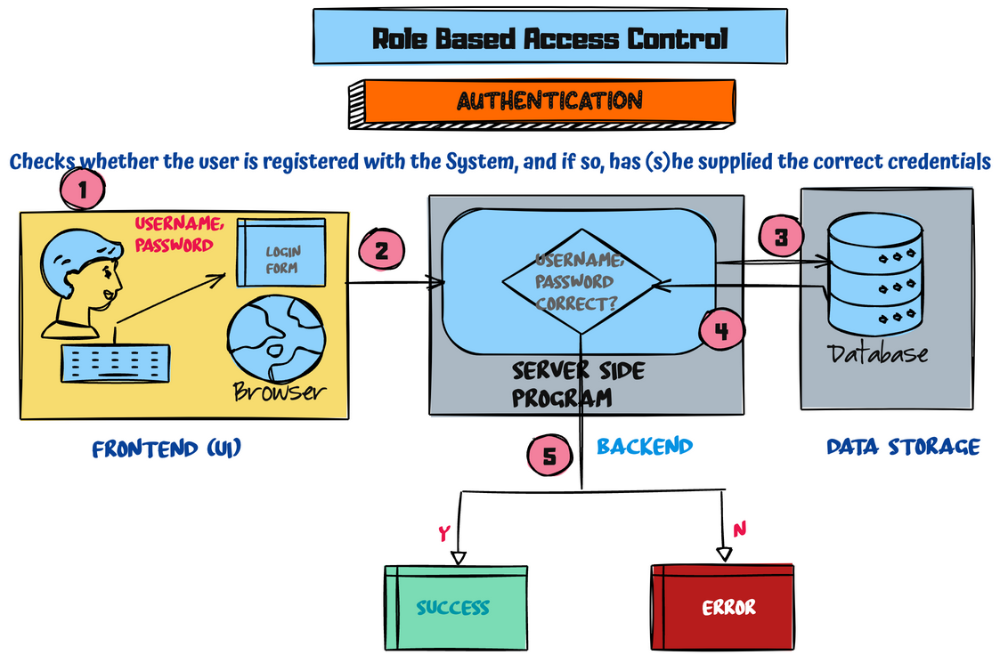
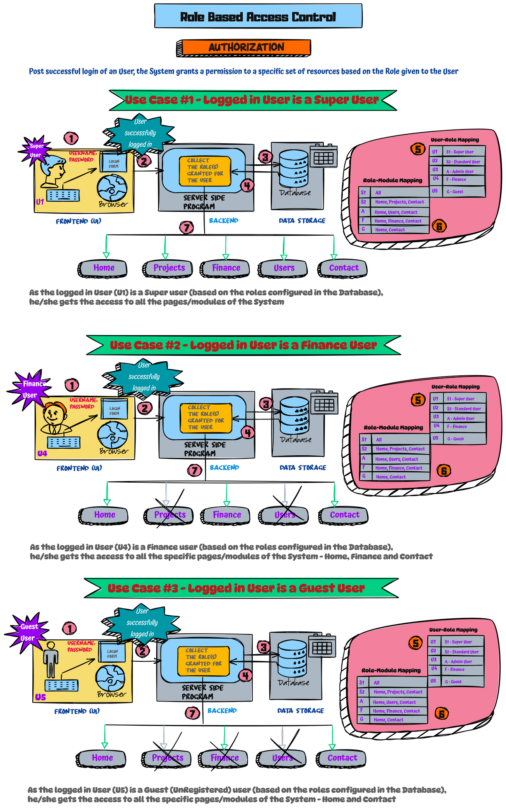

# RBAC Implementation using PHP

RBAC stands for Role Based Access Control which has the two mandatory steps in order

* Authentication - Deciding whom to allow
* Authorization  - Deciding what to allow

This project is an implementation of the RBAC control using PHP, MySQL and JWT. 

# Visual Illustrations

## Authentication

## Authorization

Explaining 3 different use cases in a pictorial way for a better understanding.

